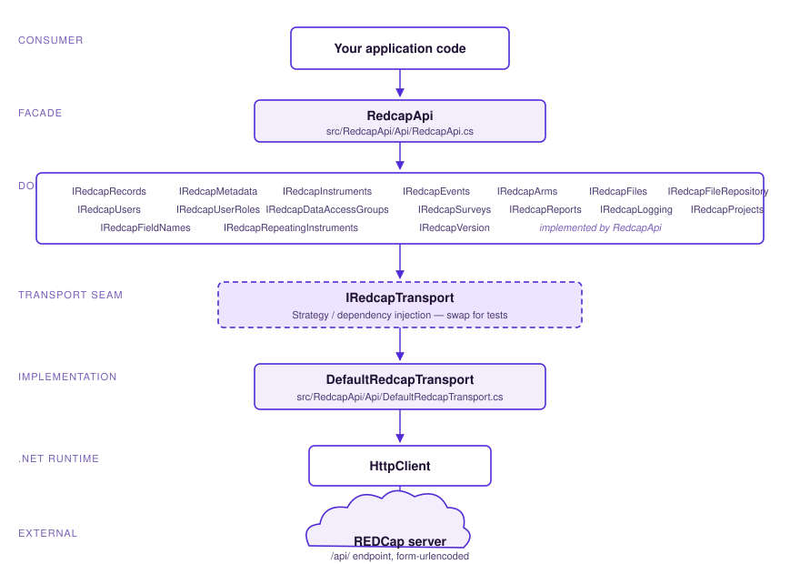
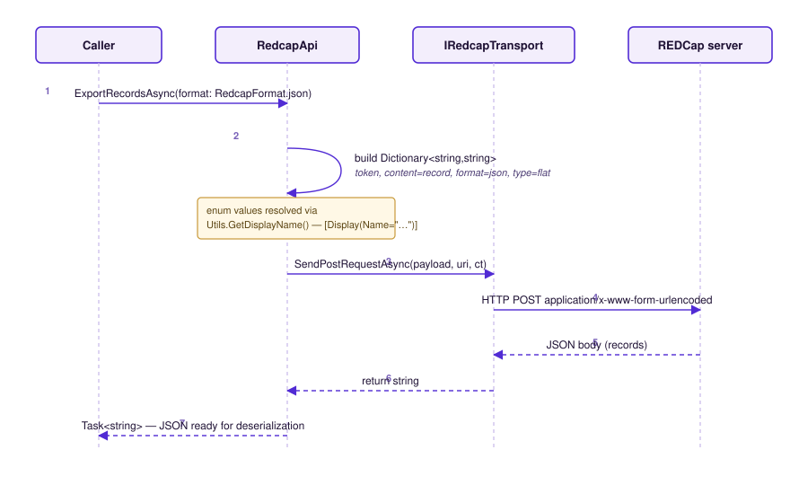
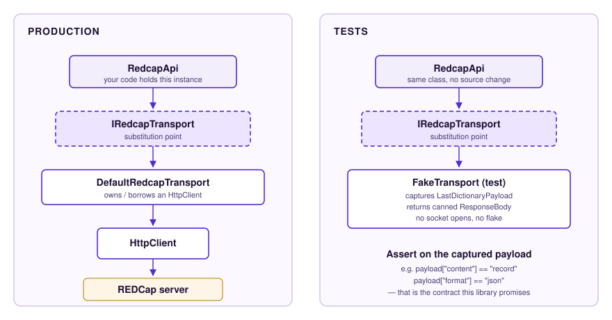
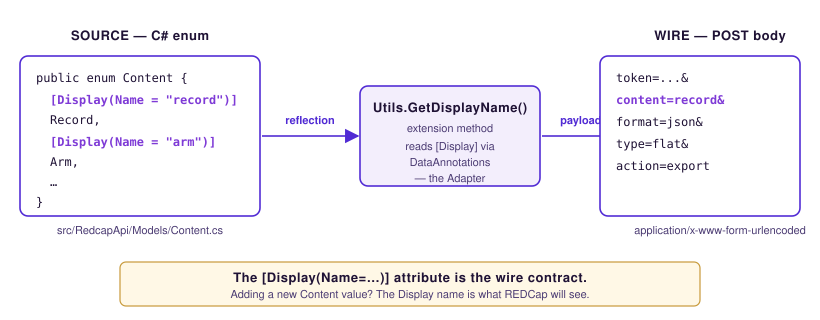

<div align="center">

# redcap-api

**A strongly-typed .NET 10 client for the [REDCap](https://www.project-redcap.org/) REST API.**

[](https://dotnet.microsoft.com)
[](LICENSE.md)
[](https://github.com/274188A/redcap-api/commits/master)

*Designed for testability. Typed end-to-end. Faithful to the REDCap wire format.*

</div>

---

## Table of contents

- [Chapter 1 — Introduction](#chapter-1--introduction)
- [Chapter 2 — Quick start](#chapter-2--quick-start)
- [Chapter 3 — Architecture](#chapter-3--architecture)
- [Chapter 4 — Design patterns](#chapter-4--design-patterns)
- [Chapter 5 — Common workflows](#chapter-5--common-workflows)
- [Chapter 6 — API reference](#chapter-6--api-reference)
- [Chapter 7 — Building, testing, contributing](#chapter-7--building-testing-contributing)
- [Chapter 8 — Migration notes](#chapter-8--migration-notes)
- [Acknowledgement of AI assistance](#acknowledgement-of-ai-assistance)
- [Glossary](#glossary)
- [References](#references)
- [Appendix A — Directory layout](#appendix-a--directory-layout)
- [Appendix B — Public API method index](#appendix-b--public-api-method-index)
- [Appendix C — Wire-format enum cheat sheet](#appendix-c--wire-format-enum-cheat-sheet)
- [Appendix D — E2E environment variables](#appendix-d--e2e-environment-variables)
- [License](#license)

---

## Chapter 1 — Introduction

[REDCap](https://www.project-redcap.org/) (Research Electronic Data Capture) is a secure, web-based platform for building and managing online surveys and databases, developed and maintained by Vanderbilt University and used at thousands of academic and research institutions worldwide [\[12\]](#references). REDCap exposes its data and project metadata through a form-urlencoded REST API.

**`redcap-api`** is a .NET 10 client library that wraps that REST API behind a strongly-typed, async-first C# surface. Rather than asking callers to assemble form payloads by hand, the library exposes one method per REDCap operation — `ExportRecordsAsync`, `ImportMetaDataAsync`, `ExportDagsAsync`, and so on — and uses C# enums (decorated with `[Display(Name="…")]`) to carry the exact wire values REDCap expects.

### Who this library is for

- Research data engineers integrating REDCap into a .NET data pipeline.
- Application teams building dashboards, ETL jobs, or admin tooling on top of a REDCap instance.
- Test authors who need to assert REDCap interactions without standing up a real REDCap server.

### Design goals

| Goal | How it shows up in the code |
|---|---|
| **Testability** | An `IRedcapTransport` seam lets every test substitute a fake transport; ~95% of tests run without a network. |
| **Type safety** | C# enums carry wire values through `[Display]` attributes; misspelling `content=record` is a compile error. |
| **Breadth** | Coverage spans every documented REDCap content type — records, metadata, instruments, events, arms, files, file repository, users, user roles, DAGs, surveys, reports, logging, and project info. |
| **Async-first** | Every public method is `async Task<T>` with optional `CancellationToken` and per-call timeout. |

### Status

- **Library version:** 2.x
- **Target framework:** `net10.0`
- **License:** [MIT](LICENSE.md), © 2026 Curtin University.

---

## Chapter 2 — Quick start

### Requirements

- .NET 10 SDK
- A REDCap instance and an API token with appropriate rights for the project you intend to access.

### Hello, REDCap

```csharp
using Redcap;
using Redcap.Models;

using var api = new RedcapApi(
    "https://your-redcap-instance/api/",
    "YOUR_API_TOKEN"
);

// Export records as JSON
var result = await api.ExportRecordsAsync(format: RedcapFormat.json);
```

The token belongs to the client instance — there is no longer a `token` parameter on every method (see [Chapter 8](#chapter-8--migration-notes)).

### Constructor variants

| Constructor | When to use it |
|---|---|
| `new RedcapApi(url, token)` | Most apps. The library creates and disposes its own `HttpClient`. |
| `new RedcapApi(url, token, IRedcapTransport transport)` | DI / `IHttpClientFactory` apps, or tests that want to inject a `FakeTransport`. The caller owns the transport's lifetime. |
| `new RedcapApi(url, token, useInsecureCertificates: true)` | Connecting to a development REDCap with a self-signed certificate. **Never** use in production. |

---

## Chapter 3 — Architecture

The library is six layers thick — and the seam in the middle is the whole point.

<p align="center">
  
  <br/>
  <em>Figure 3.1 — Layered architecture. The dashed band is the transport seam; everything below it can be swapped at construction time.</em>
</p>

### A guided tour

1. **Consumer code** holds a `RedcapApi` instance and calls high-level methods like `ExportRecordsAsync`.
2. **`RedcapApi`** ([`src/RedcapApi/Api/RedcapApi.cs`](src/RedcapApi/Api/RedcapApi.cs)) is a *facade* — a single class that implements 17 focused domain interfaces (`IRedcapRecords`, `IRedcapMetadata`, `IRedcapEvents`, …) which are aggregated by [`IRedcap`](src/RedcapApi/Interfaces/IRedcap.cs). Consumers can depend on the narrow interface they actually need; the library does not force the whole surface on them.
3. **The payload-building step** turns the typed C# call into a `Dictionary<string,string>` (or `MultipartFormDataContent` for uploads), pulling each enum's wire value from its `[Display(Name="…")]` attribute via `Utils.GetDisplayName()`. This is an *adapter* between the typed C# world and the form-urlencoded REDCap world.
4. **`IRedcapTransport`** ([`src/RedcapApi/Interfaces/IRedcapTransport.cs`](src/RedcapApi/Interfaces/IRedcapTransport.cs)) is the abstraction over HTTP. It exposes four operations: form-encoded send returning a stream, form-encoded send returning a string, multipart send, and download-to-disk.
5. **`DefaultRedcapTransport`** ([`src/RedcapApi/Api/DefaultRedcapTransport.cs`](src/RedcapApi/Api/DefaultRedcapTransport.cs)) is the production implementation. It can own its `HttpClient` or borrow one via `DefaultRedcapTransport.FromHttpClient(...)`.
6. **`HttpClient`** does the actual network I/O.

### What a single call looks like

<p align="center">
  
  <br/>
  <em>Figure 3.2 — Lifecycle of a single <code>ExportRecordsAsync</code> call.</em>
</p>

Tracing the steps in Figure 3.2:

1. Caller invokes `api.ExportRecordsAsync(format: RedcapFormat.json)`.
2. `RedcapApi` builds a payload dictionary. `Content.Record.GetDisplayName()` returns `"record"`; `RedcapFormat.json.GetDisplayName()` returns `"json"`.
3. The payload is handed to `IRedcapTransport.SendPostRequestAsync`.
4. The transport POSTs `application/x-www-form-urlencoded` to the REDCap endpoint.
5. REDCap returns a JSON body.
6. The body bubbles up unchanged to the caller as a `Task<string>`, ready for `System.Text.Json` deserialization (or, for typed convenience methods, already deserialized).

---

## Chapter 4 — Design patterns

Patterns are not decoration here — each one solves a concrete problem in a library that has to be tested without a network and extended without breaking the wire format.

### 4.1 Strategy / Seam — the transport abstraction

`IRedcapTransport` is the canonical Strategy [\[3\]](#references): one interface, multiple interchangeable implementations selected by the consumer at construction time. Michael Feathers calls the same construct a *seam* — "a place where you can alter behaviour in your program without editing in that place" [\[4\]](#references). It is the single most important architectural decision in the codebase.

<p align="center">
  
  <br/>
  <em>Figure 4.1 — Same <code>RedcapApi</code> instance, two transports.</em>
</p>

| | File |
|---|---|
| Interface | [`src/RedcapApi/Interfaces/IRedcapTransport.cs`](src/RedcapApi/Interfaces/IRedcapTransport.cs) |
| Production implementation | [`src/RedcapApi/Api/DefaultRedcapTransport.cs`](src/RedcapApi/Api/DefaultRedcapTransport.cs) |
| Test fakes | [`tests/RedcapApi.Tests/RedcapApiTransportTests.cs`](tests/RedcapApi.Tests/RedcapApiTransportTests.cs) |

> *References:* GoF *Design Patterns* — Strategy [\[3\]](#references); Feathers, *Working Effectively with Legacy Code* — seams [\[4\]](#references); Fowler, *Mocks Aren't Stubs* [\[11\]](#references).

### 4.2 Facade — `IRedcap`

Consumers who just want "give me a REDCap client" can depend on the aggregate `IRedcap` interface. Internally, `IRedcap` extends 17 narrower interfaces (one per domain). This is the textbook Facade [\[3\]](#references): one entry point for a subsystem, with the option of using the finer-grained pieces directly.

| File |
|---|
| [`src/RedcapApi/Interfaces/IRedcap.cs`](src/RedcapApi/Interfaces/IRedcap.cs) |

> *Reference:* GoF *Design Patterns* — Facade [\[3\]](#references).

### 4.3 Adapter — enum to wire value

REDCap is form-urlencoded with lower-case keys (`content=record`, `format=json`, `action=export`). The codebase models each of those parameter spaces as a C# enum, with each member decorated with `[Display(Name="…")]` [\[9\]](#references). A single extension method, `Utils.GetDisplayName()`, reads the attribute via `System.ComponentModel.DataAnnotations` and returns the wire string.

This is an Adapter [\[3\]](#references) at the boundary between typed C# and the untyped wire format.

<p align="center">
  
  <br/>
  <em>Figure 4.2 — The <code>[Display]</code> name is the wire contract.</em>
</p>

| Examples |
|---|
| [`src/RedcapApi/Models/Content.cs`](src/RedcapApi/Models/Content.cs), [`RedcapFormat.cs`](src/RedcapApi/Models/RedcapFormat.cs), [`RedcapAction.cs`](src/RedcapApi/Models/RedcapAction.cs), [`LogType.cs`](src/RedcapApi/Models/LogType.cs) |

> *References:* GoF *Design Patterns* — Adapter [\[3\]](#references); Microsoft Learn — `DisplayAttribute` [\[9\]](#references).

### 4.4 Task-based Asynchronous Pattern (TAP)

Every public method is `async Task<T>`, accepts an optional `CancellationToken`, and exposes a `timeOutSeconds` parameter. There are no synchronous overloads — REDCap is a network resource, and the library is opinionated that callers should treat it that way [\[8\]](#references).

> *Reference:* Microsoft Learn — Task-based Asynchronous Pattern (TAP) [\[8\]](#references).

### 4.5 Test Double — `FakeTransport`

The transport seam exists so tests can pin payload shape without a network. `FakeTransport`, defined inside the test project, implements `IRedcapTransport` and exposes:

- `LastDictionaryPayload` — the most recent form payload sent.
- `LastMultipartPayload` — the most recent multipart payload sent.
- `ResponseBody` — a canned response the test author sets up.

Tests then assert on the *exact* dictionary keys and values the library composed, which is the contract this library is promising to its callers. Following Meszaros's terminology [\[6\]](#references), this is a *fake* — a working implementation that takes a shortcut not suitable for production.

| File |
|---|
| [`tests/RedcapApi.Tests/RedcapApiTransportTests.cs`](tests/RedcapApi.Tests/RedcapApiTransportTests.cs) |

> *References:* Meszaros, *xUnit Test Patterns* — Fake [\[6\]](#references); Fowler, *Mocks Aren't Stubs* [\[11\]](#references).

### 4.6 Dependency Injection — constructor injection

`RedcapApi` exposes three constructors, each progressively more flexible. Modern .NET apps register the library through `IHttpClientFactory` [\[10\]](#references) and pass a borrowed `HttpClient` via the static factory `DefaultRedcapTransport.FromHttpClient(...)`.

```csharp
services.AddHttpClient("redcap");
services.AddScoped<IRedcap>(sp => {
    var http = sp.GetRequiredService<IHttpClientFactory>().CreateClient("redcap");
    var transport = DefaultRedcapTransport.FromHttpClient(http, timeOutSeconds: 100);
    return new RedcapApi(config["REDCAP_URL"], config["REDCAP_TOKEN"], transport);
});
```

> *References:* Seemann & van Deursen, *Dependency Injection Principles, Practices, and Patterns* [\[5\]](#references); Microsoft Learn — `IHttpClientFactory` [\[10\]](#references).

### 4.7 Exception translation

HTTP and REDCap-specific failures are translated to a single `RedcapApiException` carrying `StatusCode` and `ResponseBody`. Callers do not need to catch HTTP exceptions or parse REDCap's error JSON twice. This follows Bloch's guidance to throw exceptions appropriate to the abstraction [\[7\]](#references).

| File |
|---|
| [`src/RedcapApi/Exceptions/RedcapApiException.cs`](src/RedcapApi/Exceptions/RedcapApiException.cs) |

> *Reference:* Bloch, *Effective Java* (3rd ed.), Item 73 [\[7\]](#references).

---

## Chapter 5 — Common workflows

### 5.1 Inject a custom transport

```csharp
var api = new RedcapApi(
    "https://your-redcap-instance/api/",
    "YOUR_API_TOKEN",
    transport
);
```

### 5.2 Per-call timeouts and cancellation

```csharp
using var cts = new CancellationTokenSource(TimeSpan.FromSeconds(30));

var users = await api.ExportUsersTypedAsync(cancellationToken: cts.Token);
```

### 5.3 Default transport fallback timeout

If the call does not pass a positive `timeOutSeconds`, the default transport's own fallback applies:

```csharp
using Redcap.Api;

using var transport = new DefaultRedcapTransport(timeOutSeconds: 100);
using var api = new RedcapApi("https://your-redcap-instance/api/", "YOUR_API_TOKEN", transport);
```

### 5.4 `IHttpClientFactory` integration

```csharp
var httpClient = httpClientFactory.CreateClient("redcap");
var transport = DefaultRedcapTransport.FromHttpClient(httpClient, timeOutSeconds: 100);
var api = new RedcapApi("https://your-redcap-instance/api/", "YOUR_API_TOKEN", transport);
```

### 5.5 File downloads

To download a file from a REDCap file-upload field, provide a destination directory:

```csharp
var savedFileName = await api.ExportFileAsync(
    record: "1",
    field: "consent_pdf",
    eventName: "event_1_arm_1",
    filePath: "downloads"
);
```

### 5.6 Exception handling

```csharp
using Redcap.Exceptions;

try
{
    var projectInfo = await api.ExportProjectInfoTypedAsync();
}
catch (RedcapApiException ex)
{
    Console.WriteLine(ex.StatusCode);
    Console.WriteLine(ex.ResponseBody ?? ex.Message);
}
```

### 5.7 Typed vs. raw export pairs

Most export operations come in two flavours. The raw form returns a `Task<string>` containing the REDCap response body, ready for any deserializer the caller prefers. The `Typed` companion returns deserialized .NET objects — useful when the shape is stable and the caller does not need access to the raw bytes:

```csharp
// raw
string json = await api.ExportProjectInfoAsync();

// typed
RedcapProjectInfo info = await api.ExportProjectInfoTypedAsync();
```

---

## Chapter 6 — API reference

The library covers every documented REDCap content type. The table below is the canonical at-a-glance map; per-method documentation lives in the DocFX site under [`docs/index.md`](docs/index.md).

| Area | Methods |
|---|---|
| Records | `ExportRecordsAsync` `ExportRecordAsync` `ImportRecordsAsync` `DeleteRecordsAsync` `RenameRecordAsync` `GenerateNextRecordNameAsync` |
| Metadata | `ExportMetaDataAsync` `ImportMetaDataAsync` `ExportFieldNamesAsync` |
| Instruments | `ExportInstrumentsAsync` `ExportInstrumentMappingAsync` `ImportInstrumentMappingAsync` `ExportPDFInstrumentsAsync` |
| Events | `ExportEventsAsync` `ImportEventsAsync` `DeleteEventsAsync` |
| Arms | `ExportArmsAsync` `ImportArmsAsync` `DeleteArmsAsync` |
| Files | `ExportFileAsync` `ImportFileAsync` `DeleteFileAsync` |
| File repository | `ExportFilesFoldersFileRepositoryAsync` `ExportFileFileRepositoryAsync` `ImportFileRepositoryAsync` `DeleteFileRepositoryAsync` `CreateFolderFileRepositoryAsync` |
| Users | `ExportUsersAsync` `ImportUsersAsync` `DeleteUsersAsync` |
| User roles | `ExportUserRolesAsync` `ImportUserRolesAsync` `DeleteUserRolesAsync` `ExportUserRoleAssignmentAsync` `ImportUserRoleAssignmentAsync` |
| DAGs | `ExportDagsAsync` `ImportDagsAsync` `DeleteDagsAsync` `ExportUserDagAssignmentAsync` `ImportUserDagAssignmentAsync` `SwitchDagAsync` |
| Surveys | `ExportSurveyLinkAsync` `ExportSurveyParticipantsAsync` `ExportSurveyQueueLinkAsync` `ExportSurveyReturnCodeAsync` `ExportSurveyAccessCodeAsync` |
| Reports | `ExportReportsAsync` |
| Logging | `ExportLoggingAsync` |
| Project | `ExportProjectInfoAsync` `ImportProjectInfoAsync` `ExportProjectXmlAsync` `CreateProjectAsync` `ExportRedcapVersionAsync` |

---

## Chapter 7 — Building, testing, contributing

### 7.1 Build and test

```bash
dotnet restore RedcapApi.slnx
dotnet build RedcapApi.slnx -c Release
dotnet test tests/RedcapApi.Tests/RedcapApi.Tests.csproj --verbosity minimal
```

### 7.2 Test layout

| File | What it covers |
|---|---|
| `RedcapApiTransportTests.cs` | The bulk of the suite — pins exact payload shapes via `FakeTransport`. |
| `ValidationTests.cs` | Argument validation and guards. |
| `JsonSerializationTests.cs` | `System.Text.Json` round-trips. |
| `ConcurrencyTests.cs` | Concurrent use of a shared `RedcapApi`. |
| `CancellationTests.cs` | Cancellation propagation. |
| `HttpErrorTests.cs` | `RedcapApiException` translation paths. |
| `InterfaceShapeTests.cs` | Contract / overload-parity assertions. |
| `LocalHttpServer.cs` | A loopback `HttpListener` helper for end-to-end transport tests without a REDCap instance. |
| `RecordsTests.cs` | E2E (tagged `[Trait("Category", "E2E")]`) — skipped unless [Appendix D](#appendix-d--e2e-environment-variables) variables are set. |

### 7.3 Documentation

Local API documentation lives under [`docs/index.md`](docs/index.md) and can be previewed with:

```bash
dotnet tool restore --configfile NuGet.Config
dotnet restore RedcapApi.slnx --configfile NuGet.Config
dotnet docfx docs/docfx.json --serve
```

### 7.4 Contributing

See [`CONTRIBUTING.md`](CONTRIBUTING.md) for the endpoint workflow, transport-test expectations, and guidance for adding REDCap API surface area. The house style is: **every new endpoint ships with a transport test that pins the payload shape.**

---

## Chapter 8 — Migration notes

### v2.x — token moved to the constructor

```csharp
// Before
api.ExportRecordsAsync(token, ...);

// Now
var api = new RedcapApi(url, token);
api.ExportRecordsAsync(...);
```

The token now belongs to the client instance rather than being passed to each call. If you inject a custom transport, the caller still owns that transport's lifetime — `RedcapApi` does **not** dispose a transport it did not construct.

---

## Acknowledgement of AI assistance

Parts of this codebase were developed with the assistance of large-language-model tooling — primarily **[Claude Code](https://claude.com/claude-code)** (Anthropic) — across the following scopes:

- **Refactoring passes** — extracting the `IRedcapTransport` seam from inline `HttpClient` use, splitting the monolithic `IRedcap` into 17 focused domain interfaces, and tightening exception handling.
- **Test scaffolding** — generating the initial transport-test skeletons, parity tests across overloads, and the `LocalHttpServer` helper.
- **Documentation drafting** — DocFX configuration, README revisions (including this one), and code-comment cleanup.
- **Design-pattern naming and references** — articulating the patterns documented in [Chapter 4](#chapter-4--design-patterns) and selecting the canonical citations.

The following remained **human-driven** and reviewed by maintainers before merging:

- The **public API surface** and naming — what to expose, what to deprecate, and how methods compose.
- **REDCap semantic correctness** — wire-format decisions, `[Display]` names, and behavioural fidelity to the REDCap REST API.
- **Architectural trade-offs** — the choice to use a transport seam, the constructor design, and the typed-vs-raw export split.
- **Code review, release decisions, and CHANGELOG curation.**

All AI-generated code passed the existing test suite and a maintainer review before being merged. AI is treated here as augmentation, not authorship — consistent with emerging norms for AI use in research-supporting software [\[1\]](#references).

---

## Glossary

| Term | Definition |
|---|---|
| **API token** | A 32-character secret issued by REDCap that grants a single user access to a single project's API surface. Required for every API call. |
| **Arm** | A branch of a longitudinal REDCap project that groups events into a logical schedule. |
| **async / await** | C# keywords for asynchronous, non-blocking I/O. Every public method on `RedcapApi` is `async`. |
| **CancellationToken** | A .NET type used to signal that a long-running operation should stop. Accepted by every `RedcapApi` method. |
| **DAG** | Data Access Group — a REDCap mechanism that partitions records by user group. |
| **DocFX** | Microsoft's static-site generator used here to produce the API documentation site under `docs/`. |
| **Event** | A scheduled time point in a longitudinal project (e.g. *baseline*, *6-month follow-up*). |
| **Facade** | Design pattern: a single entry-point class over a wider subsystem. Embodied here by `IRedcap`. |
| **Field** | A named question/variable on a REDCap form (e.g. `consent_date`). |
| **Form / Instrument** | A group of related fields presented together to a participant or data-entry user. |
| **`IHttpClientFactory`** | The .NET factory that manages `HttpClient` lifetimes — the recommended way to create `HttpClient`s in DI apps. |
| **Longitudinal project** | A REDCap project with multiple events/timepoints per record. |
| **ODM** | Operational Data Model — a CDISC XML format REDCap can export. |
| **Project** | The top-level REDCap container holding metadata, records, users, and settings. |
| **REDCap** | Research Electronic Data Capture; a research-data-collection platform from Vanderbilt University. |
| **Record** | A single row in a REDCap project — typically one participant. |
| **Repeating instrument** | A form that may be filled in multiple times per record. |
| **Seam** | A place in code where behaviour can be swapped without editing in place — a Feathers term for the `IRedcapTransport` interface. |
| **Strategy** | Design pattern: one interface, multiple interchangeable algorithms. Embodied by `IRedcapTransport`. |
| **Survey** | A REDCap instrument exposed as a public web form. |
| **TAP** | Task-based Asynchronous Pattern — Microsoft's `Task<T>`-based async convention. |
| **Transport** | The HTTP-sending component. `DefaultRedcapTransport` in production, `FakeTransport` in tests. |
| **xUnit** | The .NET testing framework used by this project. |

---

## References

1. The REDCap consortium. *About REDCap*. https://www.project-redcap.org/
2. REDCap REST API documentation — typically available at `https://<your-instance>/redcap/api/help/` on each REDCap deployment.
3. Gamma, E., Helm, R., Johnson, R., & Vlissides, J. *Design Patterns: Elements of Reusable Object-Oriented Software*. Addison-Wesley, 1994.
4. Feathers, M. *Working Effectively with Legacy Code*. Prentice Hall, 2004.
5. Seemann, M., & van Deursen, S. *Dependency Injection Principles, Practices, and Patterns*. Manning, 2019.
6. Meszaros, G. *xUnit Test Patterns: Refactoring Test Code*. Addison-Wesley, 2007.
7. Bloch, J. *Effective Java*, 3rd edition. Addison-Wesley, 2017 — Item 73, *Throw exceptions appropriate to the abstraction*.
8. Microsoft Learn. *Task-based Asynchronous Pattern (TAP)*. https://learn.microsoft.com/dotnet/standard/asynchronous-programming-patterns/task-based-asynchronous-pattern-tap
9. Microsoft Learn. *`DisplayAttribute` Class*. https://learn.microsoft.com/dotnet/api/system.componentmodel.dataannotations.displayattribute
10. Microsoft Learn. *Use `IHttpClientFactory` to implement resilient HTTP requests*. https://learn.microsoft.com/dotnet/core/extensions/httpclient-factory
11. Fowler, M. *Mocks Aren't Stubs*. https://martinfowler.com/articles/mocksArentStubs.html
12. Harris, P. A., Taylor, R., Minor, B. L., Elliott, V., Fernandez, M., O'Neal, L., McLeod, L., Delacqua, G., Delacqua, F., Kirby, J., & Duda, S. N. The REDCap consortium: Building an international community of software platform partners. *Journal of Biomedical Informatics*, 95, 103208 (2019).

---

## Appendix A — Directory layout

```
redcap-api/
├─ src/RedcapApi/                    # library source
│  ├─ Api/                           # RedcapApi.cs (facade impl), DefaultRedcapTransport.cs
│  ├─ Interfaces/                    # IRedcap.cs, IRedcapTransport.cs, 17 domain interfaces
│  ├─ Models/                        # enums (Content, RedcapFormat, RedcapAction, …) + DTOs
│  ├─ Exceptions/                    # RedcapApiException
│  └─ Utils.cs                       # GetDisplayName extension + HttpClient helpers
├─ tests/RedcapApi.Tests/            # xUnit test project (~3,900 LOC across 11 files)
├─ docs/                             # DocFX site sources
│  ├─ diagrams/                      # SVG figures referenced from README
│  ├─ docfx.json
│  ├─ index.md
│  └─ toc.yml
├─ .github/                          # GitHub config + upgrade scenario notes
├─ Directory.Build.props             # TreatWarningsAsErrors, analyzers
├─ Directory.Packages.props          # central package versioning
├─ RedcapApi.slnx                    # solution
├─ CONTRIBUTING.md
├─ LICENSE.md
└─ README.md                         # ← you are here
```

---

## Appendix B — Public API method index

Alphabetical, useful for `Ctrl-F`:

`CreateFolderFileRepositoryAsync` · `CreateProjectAsync` · `DeleteArmsAsync` · `DeleteDagsAsync` · `DeleteEventsAsync` · `DeleteFileAsync` · `DeleteFileRepositoryAsync` · `DeleteRecordsAsync` · `DeleteUserRolesAsync` · `DeleteUsersAsync` · `ExportArmsAsync` · `ExportDagsAsync` · `ExportEventsAsync` · `ExportFieldNamesAsync` · `ExportFileAsync` · `ExportFileFileRepositoryAsync` · `ExportFilesFoldersFileRepositoryAsync` · `ExportInstrumentMappingAsync` · `ExportInstrumentsAsync` · `ExportLoggingAsync` · `ExportMetaDataAsync` · `ExportPDFInstrumentsAsync` · `ExportProjectInfoAsync` · `ExportProjectXmlAsync` · `ExportRecordAsync` · `ExportRecordsAsync` · `ExportRedcapVersionAsync` · `ExportReportsAsync` · `ExportSurveyAccessCodeAsync` · `ExportSurveyLinkAsync` · `ExportSurveyParticipantsAsync` · `ExportSurveyQueueLinkAsync` · `ExportSurveyReturnCodeAsync` · `ExportUserDagAssignmentAsync` · `ExportUserRoleAssignmentAsync` · `ExportUserRolesAsync` · `ExportUsersAsync` · `GenerateNextRecordNameAsync` · `ImportArmsAsync` · `ImportDagsAsync` · `ImportEventsAsync` · `ImportFileAsync` · `ImportFileRepositoryAsync` · `ImportInstrumentMappingAsync` · `ImportMetaDataAsync` · `ImportProjectInfoAsync` · `ImportRecordsAsync` · `ImportUserDagAssignmentAsync` · `ImportUserRoleAssignmentAsync` · `ImportUserRolesAsync` · `ImportUsersAsync` · `RenameRecordAsync` · `SwitchDagAsync`

Many of these have multiple overloads — see the DocFX site for the full set.

---

## Appendix C — Wire-format enum cheat sheet

Most often-used enums and the wire values they emit through `[Display(Name="…")]`:

| Enum | Member | Wire value |
|---|---|---|
| `Content` | `Record` | `record` |
| `Content` | `MetaData` | `metadata` |
| `Content` | `Arm` | `arm` |
| `Content` | `Event` | `event` |
| `Content` | `File` | `file` |
| `Content` | `FileRepository` | `fileRepository` |
| `Content` | `User` | `user` |
| `Content` | `UserRole` | `userRole` |
| `Content` | `Dag` | `dag` |
| `Content` | `Project` | `project` |
| `Content` | `Report` | `report` |
| `Content` | `Log` | `log` |
| `Content` | `Version` | `version` |
| `RedcapFormat` | `json` / `csv` / `xml` / `odm` | `json` / `csv` / `xml` / `odm` |
| `RedcapAction` | `Export` / `Import` / `Delete` / `Rename` / `Switch` / `Randomize` | `export` / `import` / `delete` / `rename` / `switch` / `randomize` |
| `OverwriteBehavior`* | `normal` / `overwrite` | `normal` / `overwrite` |

\* `OverwriteBehavior` does not use `[Display]` — its enum members are already lower-case, so `Enum.ToString()` produces the wire value directly.

---

## Appendix D — E2E environment variables

End-to-end tests against a real REDCap instance are skipped by default. Set these to run them:

| Variable | Description | Example |
|---|---|---|
| `REDCAP_E2E_URL` | Full URL to your REDCap API endpoint. | `https://redcap.example.edu/redcap/api/` |
| `REDCAP_E2E_TOKEN` | API token issued by your REDCap project. | `0123456789ABCDEF…` |
| `REDCAP_E2E_RECORD_ID` | A valid record ID in the project. | `1` |
| `REDCAP_E2E_FORM` | A valid instrument / form name. | `demographics` |

Run only the E2E suite:

```bash
dotnet test tests/RedcapApi.Tests/RedcapApi.Tests.csproj --filter "Category=E2E"
```

Or skip it explicitly during a non-E2E run:

```bash
dotnet test tests/RedcapApi.Tests/RedcapApi.Tests.csproj --filter "Category!=E2E"
```

---

## License

MIT — see [LICENSE.md](LICENSE.md). © 2026 Curtin University.
